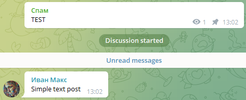
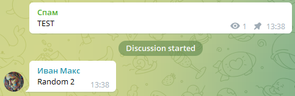
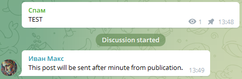
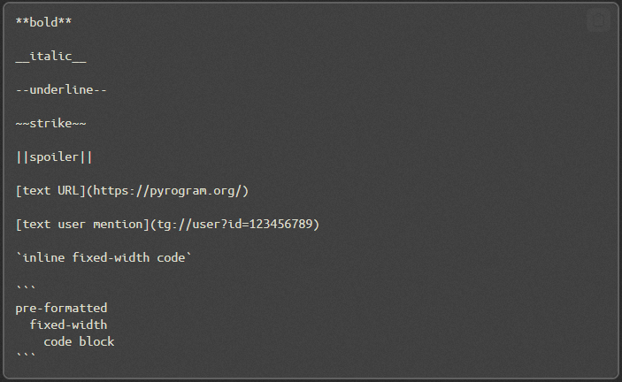
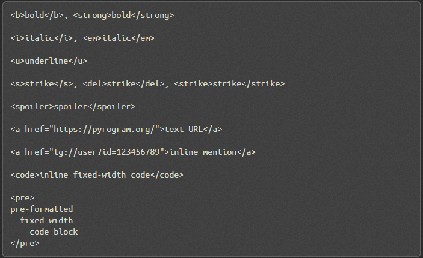

Внимание! Насколько мне известно, сейчас Pyrogram перестали обновлять и он не работает. Pyrogram - основа данного бота. Так как я не хочу создавать конкуренцию среди спамеров, данный софт обновлен не будет. Есть платная версия, я разработчик - https://github.com/plutonium777/enhanced-comments-md/blob/main/README.md . Спасибо всем, кто оставлял отзывы на счет этого спамера и благодарил!

Attention! As far as I know, Pyrogram has now stopped being updated and does not work. Pyrogram is the main framework of this bot. Since I do not want to create competition in spam, this software will not be updated. There is a paid version, I am a developer - https://github.com/plutonium777/enhanced-comments-md/blob/main/README.md. Thanks to everyone who left feedback on this spammer and said me thanks as well!
<h1 align="center">
Comments Spam Bot
</h1>
<p align="center">
This bot writes spam message at new post comments as fast as possible.
</p>

# Installation 
```
git clone https://github.com/plutonium777/telegram_comments_spamer_userbot.git
cd telegram_comments_spamer_userbot
pip install -r requirements.txt
python userbot.py
```
*Don't forget to configure data/config.ini file and variables in userbot.py*

## Delay
**_Delay = 0.25, You can increase delay between interactions with Telegram servers if your account dying fast_**

<h1 align="center">
Post Types
</h1>

## TextPost
Syntax:
```python
spam_posts = [TextPost("text")]
```
Example:
```python
spam_posts = [TextPost("Simple text post")]
```


Multiline example:
```python
spam_posts = [TextPost("""
This will be at first line
This will be at second line
This will be at third line
""")]
```

## PicturePost

*Image file needs to be in one directory with __userbot.py__*

Syntax:

```python
spam_posts = [PicturePost("photo", "caption")]
```
Example:
```python
spam_posts = [PicturePost("nat.jpg", "Beautiful nature! 😉")]
```

## StickerPost
*You can get sticker id here:* https://t.me/sticker_file_id_bot

Syntax:
```python
spam_posts = [StickerPost("sticker_id")]
```
Example:
```python
spam_posts = [StickerPost("CAACAgIAAxkBAAL6PGIzHXlhIR_MIRDTXaXz116O2Ic8AAJpAAOmysgM41g56v0Hj1wjBA")]
```

## RandomPost

Syntax:
```python
spam_posts = [RandomPost(posts))]
```
Example:
```python
spam_posts = [RandomPost(TextPost("Random 1"), TextPost("Random 2"))]
```

## MultiPost

Syntax:
```python
spam_posts = [posts]
```
Example:
```python
spam_posts = [TextPost("Some text!"), PicturePost("nat.jpg", "And a beautiful nature!")]
```

## DelayedPost

Syntax:
```python
spam_posts = [post(..., delay=seconds)]
```
Example:
```python
spam_posts = [TextPost("1st!", delay=2), PicturePost("nature.jpg", "nature", delay=4)]
```


# Markdown
Both methods are allowed:


## Used Python modules
```
pyrogram=1.4.16
tgcrypto
```

## Any questions?
* Ask me on [Telegram](https://t.me/wasd_plutonium)
